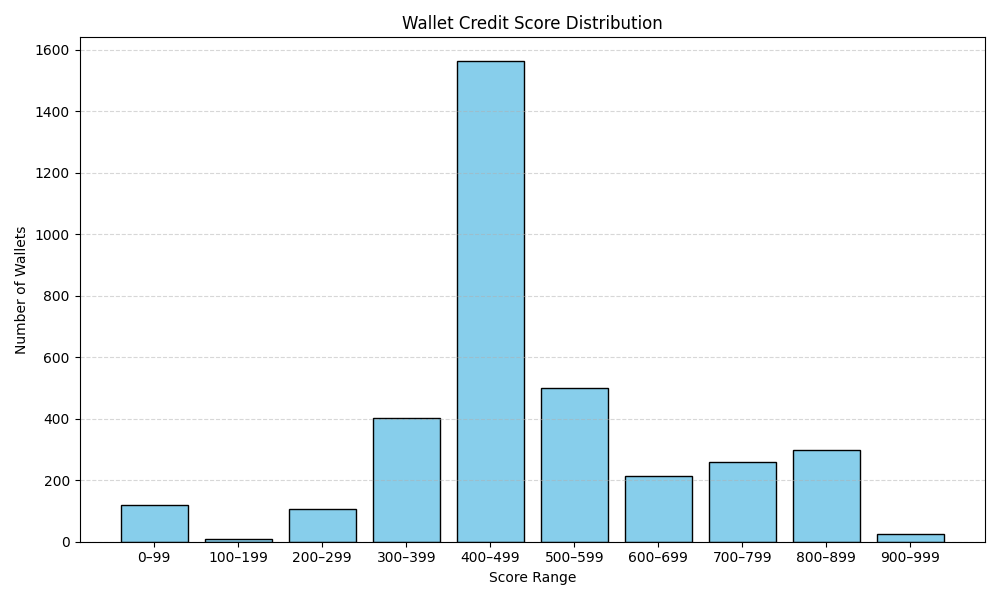

# Wallet Score Analysis

This analysis provides insights into wallet behavior within the Aave V2 protocol based on credit scores generated from raw transaction history. Each wallet is scored between 0 and 1000 using transaction features such as deposits, borrowings, repayments, redemptions, and liquidation events.

---

## Score Distribution Table

| Score Range | Number of Wallets |
|-------------|-------------------|
| 0–99        | 119               |
| 100–199     | 9                 |
| 200–299     | 108               |
| 300–399     | 403               |
| 400–499     | 1563              |
| 500–599     | 500               |
| 600–699     | 213               |
| 700–799     | 261               |
| 800–899     | 297               |
| 900–999     | 24                |

---

## Score Distribution Graph

The following chart visualizes how wallet credit scores are distributed across the defined ranges:

---

## Behavior of Wallets in Lower Score Ranges (0–300)

Wallets in the 0–300 range often show riskier or unreliable financial behavior:
- Minimal or no deposits.
- High borrowing with no repayments.
- Frequent liquidation events.
- Short activity span (often one-time interactions).
- Possible indication of bots or exploitative actors.

---

## Behavior of Wallets in Higher Score Ranges (700–1000)

Wallets with scores above 700 generally demonstrate responsible and stable DeFi behavior:
- Consistent and large deposits.
- Borrowing is followed by timely repayments.
- No liquidation events recorded.
- Long and active participation over many days.
- Healthy borrow-to-deposit and repayment ratios.

---

## Summary

This scoring model helps identify trustworthy wallet behavior based on real Aave V2 transaction history. It distinguishes between responsible users and potentially risky wallets. Such analysis can serve as a foundation for building DeFi-native credit scoring systems or trust metrics in decentralized lending platforms.
